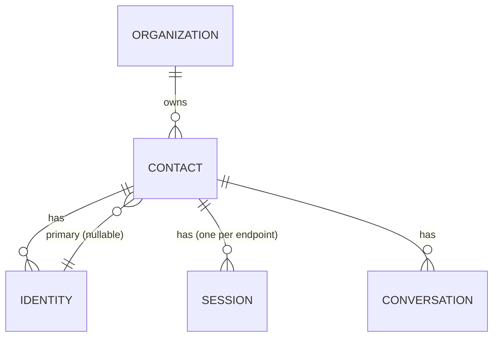

# Contact

The `Contact` is the canonical customer aggregate. It is **provider-agnostic**: one Contact may be reachable across many channels via one or more `Identity` rows.

## Invariants

- `Contact` belongs to exactly one `Organization` (multi-tenancy).
- `PrimaryIdentityID` is nullable but, when set, must reference an `Identity` whose `contact_id` points back at this Contact.
- `(org_id, primary_identity_id)` is unique — a given identity is the primary of at most one contact per org.
- `DisplayName` is normalised via `NormalizeDisplayName` (trim + collapse spaces). Empty names are rejected.

## Relationships

## Fields

| Field | Notes |
|-------|-------|
| `ID` | ULID/UUIDv7 (VARBINARY(16) in MySQL). |
| `OrgID` | Tenant. |
| `DisplayName` | Human-friendly name; normalised. |
| `AvatarURL` | Optional. |
| `PrimaryIdentityID` | Primary channel identity (for UI + inbox sort). |
| `LastSeenAt` | Advanced by `Touch()` whenever a fresh inbound arrives. |
| `CreatedAt`, `UpdatedAt` | Timestamps. |

## Persistence

`contacts` table — see `migrations/20260903000002_phase1_domain.up.sql`.
