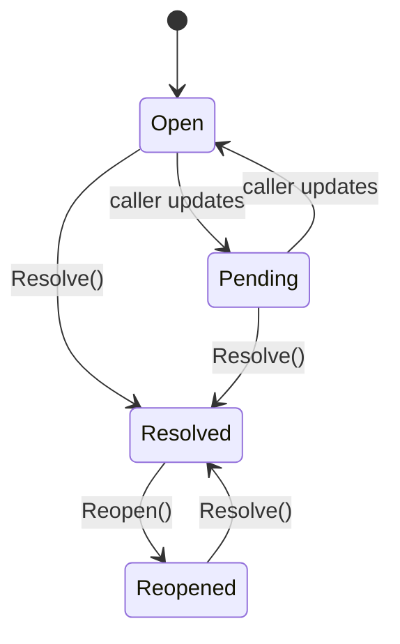

# Conversation

A `Conversation` is the customer-service work context inside a `Session`. One Session may host many Conversations over time — each with its own status, assignee, priority, and SLA state.

## Invariants

- Every Conversation belongs to exactly one Session (which belongs to one BusinessEndpoint + Contact).
- Only certain `Status` transitions are legal — enforced by `Resolve()` and `Reopen()`:

## Fields

| Field | Notes |
|-------|-------|
| `ID` | ULID/UUIDv7. |
| `OrgID`, `SessionID`, `ContactID` | Tenant + parent aggregates. |
| `Status` | `open` \| `pending` \| `resolved` \| `reopened`. |
| `AssignedUserID`, `AssignedTeamID` | Optional. |
| `Priority` | `low` \| `normal` \| `high` \| `urgent`. |
| `UnreadCount` | Bumped by `RecordInbound`, zeroed by `MarkRead`. |
| `LastMessageAt` | Set on every recorded direction. |
| `SLADueAt` | Populated by SLA engine (Phase 4). |
| `AIState`, `BotState` | Free-form state tokens for AI + bot flows. |
| `Tags` | JSON array. |

## Persistence

`conversations` — indexes lead with `org_id`:

- `(org_id, status, last_message_at)` — inbox view.
- `(org_id, contact_id, last_message_at)` — contact 360.
- `(org_id, assigned_user_id, status)` — "my open".
