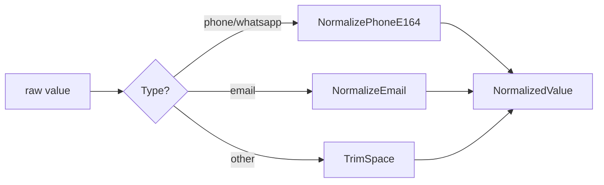

# Identity

An `Identity` is a Contact's addressable value on a specific channel + provider (phone, email, WhatsApp `wa_id`, BSUID, external CRM ID, social handle).

## Invariants

- `(OrgID, Provider, NormalizedValue)` is unique — the merge key.
- Values are always stored in `NormalizedValue` in their canonical form:
  - `TypePhone`, `TypeWhatsApp` → E.164 via `NormalizePhoneE164` (leading `+`, 8–15 digits).
  - `TypeEmail` → lower-cased, trimmed.
  - Everything else → trimmed as-is.

## Types

```go
TypePhone     // E.164
TypeEmail     // RFC 5322 (loose)
TypeWhatsApp  // WhatsApp wa_id (digits, normalised to +digits)
TypeBSUID     // Meta Business-Scoped User ID
TypeExternal  // opaque CRM ID
TypeSocial    // instagram / messenger handle
```

## Normalisation



`NormalizePhoneE164` accepts values with or without a leading `+`, strips spaces / dashes / dots / parentheses, and rejects non-digit characters. This lets us funnel both keyboarded phone numbers and WhatsApp `wa_id`s (digits only) through a single canonical form.

## Persistence

`contact_identities` — unique on `(org_id, provider, normalized_value)`. Original `identity_value` is preserved for audit.
