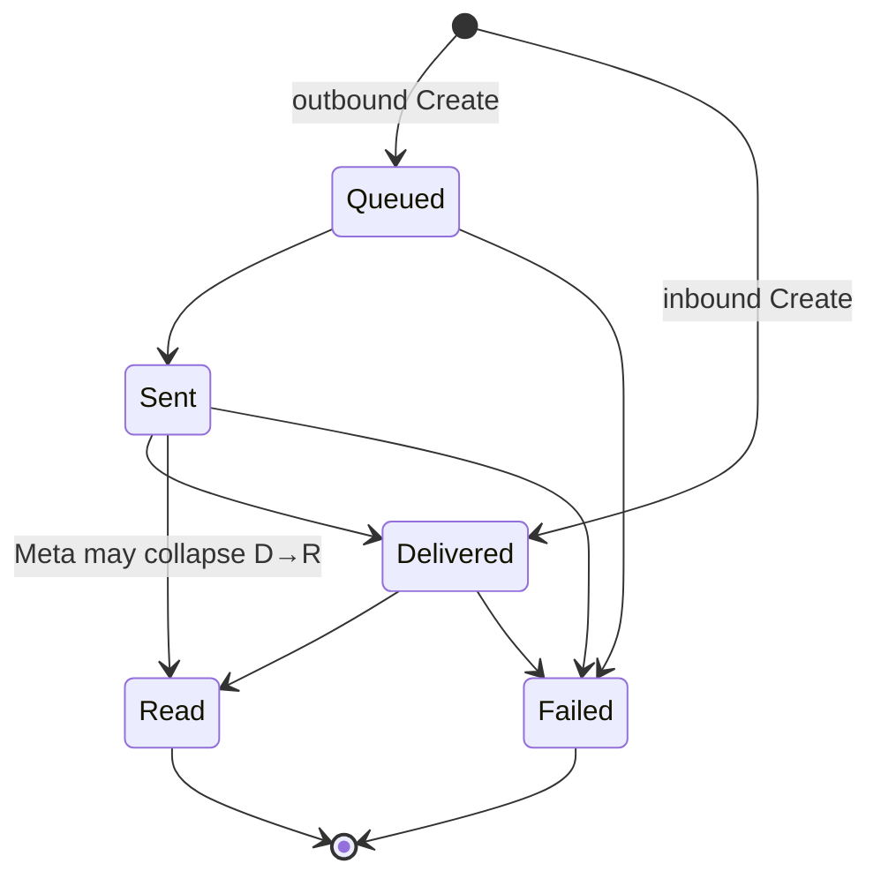

# Message

A `Message` row is the **metadata** for a single message. The full payload lives in HBase referenced by `PayloadRef`; MySQL only carries the operational shape that inbox queries + status webhooks need.

## Invariants

- Every message belongs to a `Session` and a `Conversation` (which both belong to a `Contact`).
- `(OrgID, Provider, ProviderMessageID)` is unique — inbound status updates are idempotent by design.
- `Status` transitions follow the state machine below. `Transition()` enforces this in the domain.

## State machine



- Inbound messages are created directly at `delivered` (or higher) — they never pass through `queued`.
- `Transition()` is idempotent for same-state calls (returns nil, no timestamp mutation).
- `Read` back-fills `SentAt` + `DeliveredAt` if they were missing (Meta sometimes collapses statuses).

## Types

The canonical vocabulary is provider-neutral:

```
text, image, video, audio, document, sticker,
location, contacts, template, interactive,
reaction, button, system, unknown
```

`unknown` preserves the original provider payload in `Metadata` so we can roll it forward later without dropping data.

## Persistence

`messages` table with these indexes (all lead with `org_id`):

- `uk_messages_org_provider_msg (org_id, provider, provider_message_id)` — idempotency.
- `ix_messages_org_conv_created (org_id, conversation_id, created_at)` — thread view.
- `ix_messages_org_contact_created (org_id, contact_id, created_at)` — contact timeline.
- `ix_messages_org_status (org_id, status)` — retry sweeps.

HBase carries the payload row keyed by the canonical row keys documented in `docs/architecture.md` → Data architecture → HBase.
