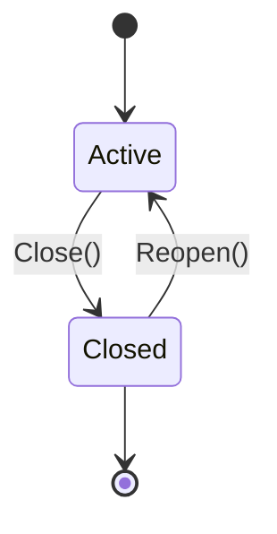

# Session

A `Session` is the persistent communication relationship between one **business endpoint** (e.g. a WhatsApp Business phone number) and one **contact**. Conversations are nested under a Session; messages are attached to both.

## Invariants

- At most one `active` Session exists per `(org_id, business_endpoint_id, contact_id)`.
  - Enforced in MySQL 8 via a `STORED GENERATED` column `active_contact_id` that mirrors `contact_id` only when `status='active'`, with a UNIQUE index over `(org_id, business_endpoint_id, active_contact_id)`.
  - MySQL treats multiple NULLs as distinct, so any number of `closed` sessions coexist.
- Reopening a closed session requires that no other active session exists for the tuple — enforced by the same UNIQUE index (attempting `Reopen` on a duplicate returns a duplicate-key error at the repo).

## Lifecycle

## Fields

| Field | Notes |
|-------|-------|
| `ID` | ULID/UUIDv7. |
| `OrgID`, `ContactID`, `BusinessEndpointID` | Tenant + participants. |
| `Status` | `active` \| `closed`. |
| `OpenedAt`, `ClosedAt` | Timestamps. |
| `Metadata` | Provider-specific bag (e.g. WhatsApp customer service window expiry). |

## Persistence

`sessions_comm` — see the migration for full schema.
