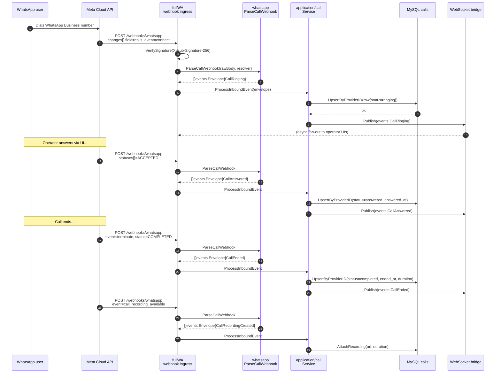

# Flow: Inbound WhatsApp call

An inbound call is a user-initiated call from a WhatsApp customer to the
business phone number. The full lifecycle is driven by Meta webhooks
against the `calls` field on the `whatsapp_business_account` object.

## Sequence

## Idempotency

`UpsertByProviderID` matches on `(org_id, provider, provider_call_id)`.
Redelivery of the same webhook advances state monotonically — a terminal
status cannot be un-set.

## Failure modes

- Unknown `phone_number_id` → parser returns an empty envelope list, the
  ingress ACKs 200. The row is dropped rather than misattributed.
- Endpoint delete-then-webhook race → row is persisted with a null
  `business_endpoint_id`.
- Signature verification failure → ingress returns 401 before touching
  the parser.

## Code references

- Parser: [`internal/providers/whatsapp/calling.go`](../../internal/providers/whatsapp/calling.go)
  (`ParseCallWebhook`)
- Service: [`internal/application/call/service.go`](../../internal/application/call/service.go)
  (`ProcessInboundEvent`)
- Repo: [`internal/infrastructure/mysql/calls.go`](../../internal/infrastructure/mysql/calls.go)
  (`UpsertByProviderID`, `AttachRecording`)
