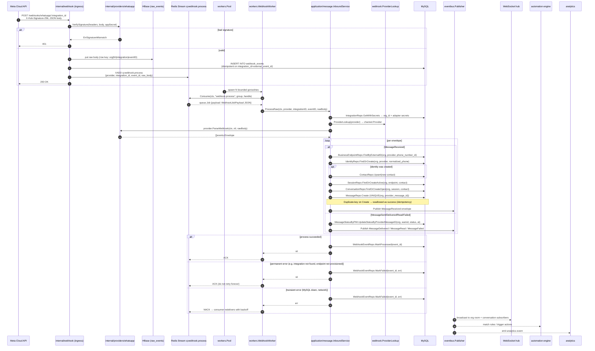

# Inbound message flow

End-to-end: Meta HTTP webhook → canonical `MessageReceived` → agent inbox.

## Layered responsibilities

- **`internal/webhook`** (ingress) — provider-agnostic HTTP entry point.
  Verifies signatures via the adapter, persists the raw body, ACKs 200,
  enqueues a `WebhookJobPayload` on `q:webhook.process`. Also owns
  `ProviderLookup(providerKey)` — the runtime channel-provider registry
  that returns a `channel.Provider` implementation for a stable key.
- **`internal/workers`** — bounded goroutine pool + the `WebhookWorker`
  that decodes jobs and drives `InboundService.ProcessRaw`. The pool is
  the only sanctioned goroutine-spawning point in the codebase
  (`CLAUDE.md` §11).
- **`internal/application/message`** — the `InboundService`. Loads the
  integration, resolves the provider adapter via the injected lookup,
  calls `ParseWebhook`, and orchestrates domain-level persistence per
  envelope. Never imports any provider package.
- **`internal/providers/whatsapp`** — the concrete adapter. Owns
  Meta-shape parsing; produces canonical `events.Envelope` values.
- **`internal/domain/*`** — pure canonical types. No infra imports.

## Idempotency + failure semantics

- **Signature verification** runs on the **raw** body — no
  re-serialisation, or the MAC breaks.
- **Ingress idempotency**: `UNIQUE(integration_id, external_event_id)` on
  `webhook_events` absorbs Meta redeliveries at the door.
- **Message idempotency**: `UNIQUE(org, provider, provider_message_id)` on
  `messages`. The InboundService catches duplicate-key errors from
  `MessageRepo.Create` via `IsDuplicateMessage` and treats them as
  success — no double publish.
- **Permanent errors** (integration deleted, provider not registered,
  business endpoint not provisioned, malformed payload) mark the
  `webhook_events` row failed and ACK the queue job — no retry storm.
- **Transient errors** (MySQL down, network) mark the row failed with
  the last error and return the error so the consumer redelivers per
  its backoff policy. The reconciler picks up any row still in
  `status='received'` past a threshold.
- The application layer never imports `internal/providers/whatsapp` —
  it works with `events.Envelope` values and looks up providers by
  string key via `webhook.ProviderLookup`.
- Persistence is per-envelope; **no DB transaction spans the provider
  call**, honouring the prime directive in `CLAUDE.md` §2.
