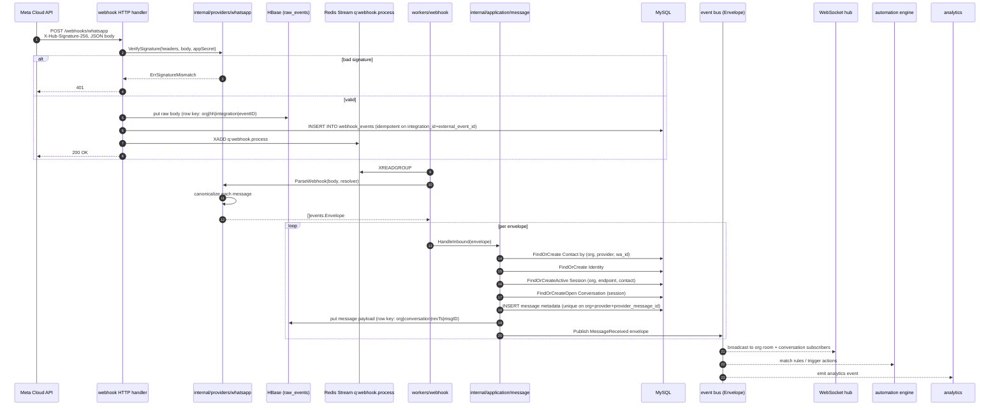

# Inbound message flow

End-to-end: Meta HTTP webhook → canonical `MessageReceived` → agent inbox.

Notes:

- Signature verification runs on the **raw** body — no re-serialisation, or the MAC breaks.
- The 200 is returned **before** parsing/queuing side-effects propagate. Idempotency (unique on `webhook_events(integration_id, external_event_id)` + unique on `messages(org, provider, provider_message_id)`) ensures replays are safe.
- The application layer never imports `internal/providers/whatsapp`. It works with `events.Envelope` / `MessageReceivedPayload` values only.
