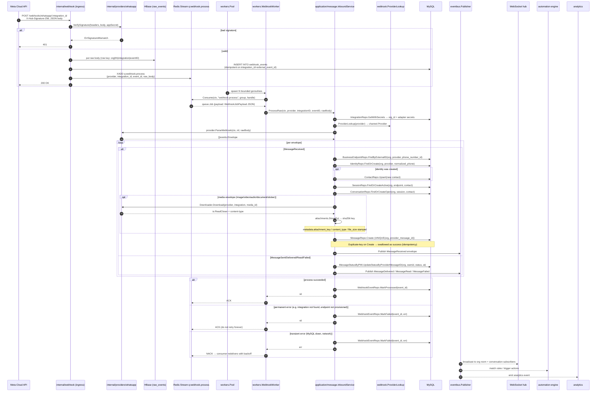
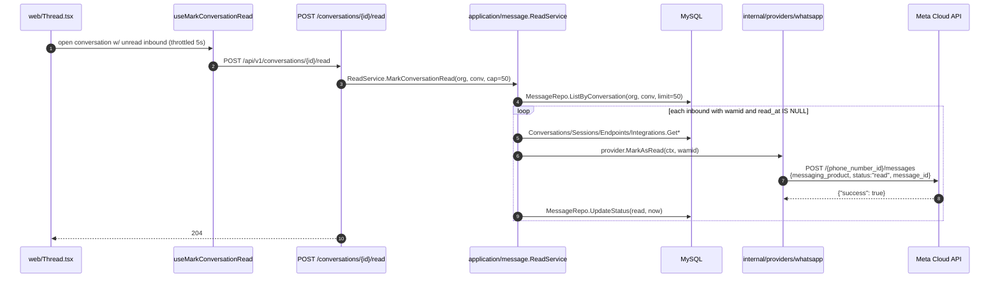

# Inbound message flow

End-to-end: Meta HTTP webhook → canonical `MessageReceived` → agent inbox.

## Layered responsibilities

- **`internal/webhook`** (ingress) — provider-agnostic HTTP entry point.
  Verifies signatures via the adapter, persists the raw body, ACKs 200,
  enqueues a `WebhookJobPayload` on `q:webhook.process`. Also owns
  `ProviderLookup(providerKey)` — the runtime channel-provider registry
  that returns a `channel.Provider` implementation for a stable key.
- **`internal/workers`** — bounded goroutine pool + the `WebhookWorker`
  that decodes jobs and drives `InboundService.ProcessRaw`. The pool is
  the only sanctioned goroutine-spawning point in the codebase
  (`CLAUDE.md` §11).
- **`internal/application/message`** — the `InboundService`. Loads the
  integration, resolves the provider adapter via the injected lookup,
  calls `ParseWebhook`, and orchestrates domain-level persistence per
  envelope. Never imports any provider package.
- **`internal/providers/whatsapp`** — the concrete adapter. Owns
  Meta-shape parsing; produces canonical `events.Envelope` values.
- **`internal/domain/*`** — pure canonical types. No infra imports.

## Idempotency + failure semantics

- **Signature verification** runs on the **raw** body — no
  re-serialisation, or the MAC breaks.
- **Ingress idempotency**: `UNIQUE(integration_id, external_event_id)` on
  `webhook_events` absorbs Meta redeliveries at the door.
- **Message idempotency**: `UNIQUE(org, provider, provider_message_id)` on
  `messages`. The InboundService catches duplicate-key errors from
  `MessageRepo.Create` via `IsDuplicateMessage` and treats them as
  success — no double publish.
- **Permanent errors** (integration deleted, provider not registered,
  business endpoint not provisioned, malformed payload) mark the
  `webhook_events` row failed and ACK the queue job — no retry storm.
- **Transient errors** (MySQL down, network) mark the row failed with
  the last error and return the error so the consumer redelivers per
  its backoff policy. The reconciler picks up any row still in
  `status='received'` past a threshold.
- The application layer never imports `internal/providers/whatsapp` —
  it works with `events.Envelope` values and looks up providers by
  string key via `webhook.ProviderLookup`.
- Persistence is per-envelope; **no DB transaction spans the provider
  call**, honouring the prime directive in `CLAUDE.md` §2.

## Media persistence

Meta only carries a `media_id` handle in the webhook — the raw bytes
live behind a short-lived signed URL that must be fetched with the
integration's access token before it expires. The `InboundService`
handles this via the `AttachmentDownloader` port so no provider package
is imported at the application layer:

1. On each `MessageReceived` whose `Payload` is a `MediaPayload` with a
   non-empty `MediaID`, the service calls
   `Downloader.Download(ctx, providerKey, integrationID, mediaID)`.
2. The returned `io.ReadCloser` is streamed into
   `attachments.Store.Put(ctx, contentType, r)`. The dev implementation
   (`internal/infrastructure/attachments.LocalFS`) is content-addressed
   by SHA-256, sharded 2/2 under `Config.Root`, with a `.contenttype`
   sidecar file recording the MIME string.
3. The resulting key + content-type + size are stamped on
   `msg.metadata` as `attachment_key`, `content_type`, `file_size`.
   The REST `MessageDTO.MediaURL` becomes `/api/v1/media/<key>` for
   downloaded media and falls back to the provider-native URL only
   when the download was skipped or failed.
4. Download / store failures WARN-log and swallow — the message row
   still commits, and the browser renders "Attachment unavailable"
   instead of blocking the thread.

`GET /api/v1/media/{key}` (and `HEAD`) streams the bytes back with
`Cache-Control: private, max-age=86400`. The route is auth-gated so
downloaded media stays inside the tenant boundary even if the
content-addressed key leaks.

## Mark-as-read callback

Operators triggering "message read" on the business side (the blue-tick on
the customer's phone) drives:

Meta does not deliver a status callback back to us for a business-side
read — the read event exists only on the customer's client. `ReadService`
therefore stamps `messages.read_at` locally so the row's status is
authoritative for the inbox unread-count.
