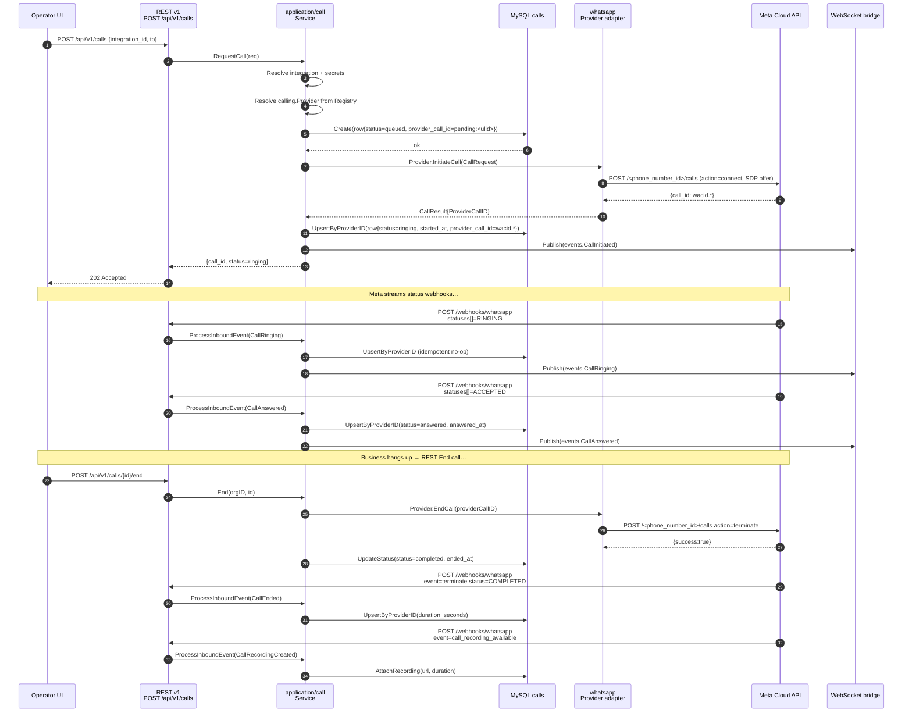

# Flow: Outbound WhatsApp call

An outbound call is a business-initiated call placed via the Nudgeway
operator UI. The full lifecycle spans a synchronous REST request that
persists a queued row + kicks off the Meta initiate, followed by an
asynchronous stream of webhooks that advance the row through the state
machine.

## Sequence

## Why Create-then-Upsert?

We insert the row before calling Meta so a crash between "Meta accepted"
and "we recorded the id" leaves a queued row that a sweeper can retry
(or manually reconcile). The initial insert uses a `pending:<ulid>`
placeholder for `provider_call_id` to satisfy the unique index; the
subsequent `UpsertByProviderID` overwrites it with the real wacid.

## Failure modes

- Provider returns 4xx → row marked `failed`; 502 surfaced to caller.
- Provider returns 5xx / transient → row stays queued; caller gets 502
  and retries (idempotency key ensures no duplicate placement).
- Webhook delivery delayed → row status may lag reality but eventually
  converges. The state machine is monotonic — a stale RINGING webhook
  cannot revert a completed row.

## Code references

- Handler: [`internal/api/rest/v1/calls.go`](../../internal/api/rest/v1/calls.go)
- Service: [`internal/application/call/service.go`](../../internal/application/call/service.go)
- Adapter: [`internal/providers/whatsapp/calling.go`](../../internal/providers/whatsapp/calling.go)
