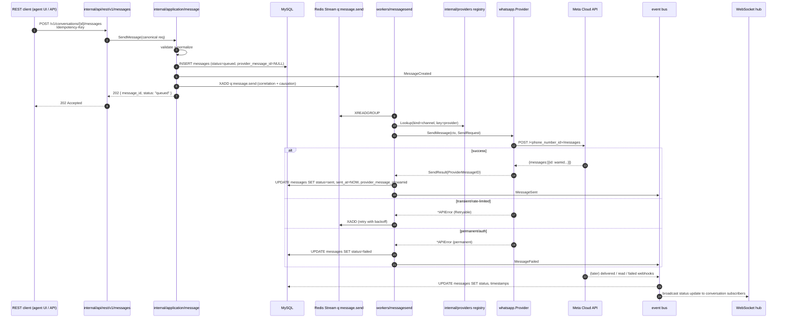

# Outbound send flow

Agent (or automation) posts a message → Meta accepts → status webhooks close the loop.

Guarantees:

- Message row is inserted (with `status=queued`) **before** the queue push — a crash between DB and queue is recovered by a sweeper on the `(org_id, status)` index.
- No DB transaction is held across the Meta call.
- `Idempotency-Key` from the API is echoed as `biz_opaque_callback_data` on the Meta payload — subsequent status webhooks carry it back, allowing the worker to reconcile without a client roundtrip.
