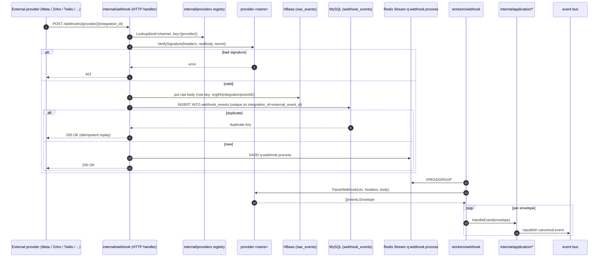

# Webhook ingestion — generic ingress + provider dispatch

fullWA exposes a single generic webhook ingress under `internal/webhook/`. It routes based on integration/provider derived from the URL path — `/webhooks/{provider}/{integration_id}` — and hands the raw body to the matching provider adapter.

Key properties:

- The HTTP handler never types a Meta / Twilio / Zoho struct — those live inside the adapter package. The handler only knows the port surface: `VerifySignature`, `ParseWebhook`.
- Idempotency is enforced at two layers:
  1. `webhook_events(integration_id, external_event_id)` unique index — dedupes at ingress.
  2. `messages(org, provider, provider_message_id)` unique index — dedupes at persistence, so a partial replay after a crash never double-inserts a message.
- Raw envelopes are written to HBase before ACK so debugging + replay never require re-fetching from the provider.
- 200 is returned **before** application processing so providers do not retry when the queue is behind.
