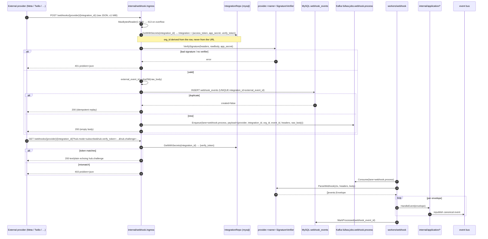

# Webhook ingestion — generic ingress + provider dispatch

fullWA exposes a single generic webhook ingress at `internal/webhook/` mounted by the REST router at:

- `GET  /webhooks/{provider}/{integration_id}` — Meta-style subscription verification handshake.
- `POST /webhooks/{provider}/{integration_id}` — signed delivery.

Both endpoints are **unauthenticated at the HTTP layer** (external providers cannot present our session cookie or CSRF token). Authenticity is enforced per-provider through a `webhook.SignatureVerifier` interface implemented by each adapter — for WhatsApp, that is `whatsapp.VerifySignature` (HMAC-SHA256 over the raw body against Meta's `X-Hub-Signature-256` header).

Key properties (as shipped in Phase 1 Task 2):

- The HTTP handler never types a Meta / Twilio / Zoho struct — those live inside the adapter package. The handler only knows the port surface: `SignatureVerifier.VerifySignature` at ingress, `channel.Provider.ParseWebhook` at the worker.
- **Signature verification runs before any parsing.** A forged body cannot reach the parser.
- **Body cap: 1 MiB** via `http.MaxBytesReader`. Larger requests get 413 problem+json.
- Idempotency is enforced at two layers:
  1. `webhook_events(integration_id, external_event_id)` UNIQUE index — dedupes at ingress. `external_event_id = sha256(raw_body)` because Meta envelopes carry no top-level id.
  2. `messages(org, provider, provider_message_id)` UNIQUE index — dedupes at persistence, so a partial replay after a crash never double-inserts a message.
- Raw envelopes are written to `webhook_events.raw_body` **before** the 200 ACK so debugging + replay never require re-fetching from the provider.
- 200 is returned **before** application processing so providers do not retry when the queue is behind. If enqueue fails after the row is persisted, the ingress still ACKs 200 — a reconciler over `Status=received` rows picks it up.
- Every log line carries `request_id`, `provider`, `integration_id`, `org_id`, `event_id`, `sig_ok`, `dup`.
- `org_id` is derived from the Integration row, **never** trusted from the URL. Posting a WhatsApp-signed body to a Twilio integration id gets 404.
