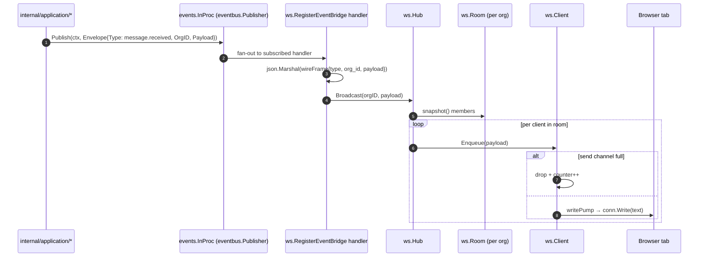

# WebSocket real-time fan-out

End-to-end: a canonical domain event fires in the app → the in-proc event
bus dispatches it → the WebSocket bridge serialises it → the per-org Hub
Room fans it out to every live browser tab in that tenant.

Phase 1 ships this as a node-local hub. Cross-node fan-out (Redis pub/sub
or Kafka broadcast) is a Phase 2 concern; the wire contract with the
browser will not change when that lands.

## Sequence



## Bridged events (Phase 1)

The bridge subscribes to a curated allow-list so no event accidentally
leaks to the browser:

- `message.received`, `message.sent`, `message.delivered`, `message.read`,
  `message.failed`
- `conversation.created`, `conversation.updated`, `conversation.assigned`,
  `conversation.resolved`

New event types must be added to `bridgedTypes` in
`internal/infrastructure/websocket/bridge.go` explicitly.

## Wire frame

Every server→client frame is UTF-8 JSON:

```json
{
  "type": "message.received",
  "org_id": "01H...",
  "occurred_at": "2026-09-04T12:34:56.789Z",
  "correlation_id": "req_...",
  "payload": { "…": "canonical event payload" }
}
```

The very first frame after upgrade is a `hello`:

```json
{ "type": "hello", "org_id": "01H...", "user_id": "01H...", "version": 1 }
```

Phase 1 is **server → client only**. The read pump discards inbound frames
and closes the connection when the peer closes.

## Connection lifecycle

1. Browser opens `GET /ws/inbox` with the session cookie.
2. `SessionAuth` middleware resolves the Principal; `RequireAuth` rejects
   401 if absent.
3. `wsapi.InboxHandler` calls `websocket.Accept` with a strict
   `OriginPatterns` allow-list (Vite dev + embedded prod).
4. A `ws.Client` is registered on the org's `Room`.
5. The hello frame is enqueued.
6. Two goroutines run per connection: a read pump (drain + observe close)
   and a write pump (drain send queue + periodic ping every
   `PingInterval`, defaulting to 25 s; writes bounded by `WriteTimeout`).
7. On peer close, ctx cancel, or hub shutdown, both pumps return and the
   Room membership is cleaned up.

## Back-pressure

`Client.Enqueue` is non-blocking: if the per-client send channel (default
buffer 64) is full, the frame is dropped and the drop counter increments
on both the client and the hub. This is deliberate — a single slow tab
must not stall the fan-out for every other tab in the tenant.

Drops surface in three places:

- `slog.Warn("ws broadcast dropped: client send queue full", …)` per drop.
- `Client.Dropped()` counter, logged on disconnect.
- `Hub.Stats()` aggregate for future `/metrics` wiring.
